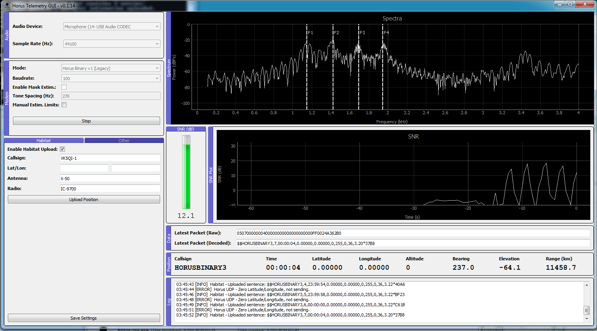

# Project Horus Telemetry Decoder

Telemetry demodulator for the following modems in use by Project Horus
* Horus Binary Modes (4FSK)
  * v1 - Legacy 22 byte mode, Golay FEC
  * v2 - 16/32-byte modes, LDPC FEC (Still in development)
* RTTY (7N2 and 8N2, standard UKHAS sentences with CRC16 only)

This project serves as a graphical front-end to [horusdemodlib](https://github.com/projecthorus/horusdemodlib) a Python/C library of telemetry demodulators based off the [codec2](https://github.com/drowe67/codec2) FSK modem. The core modem used in this library is very well tested, and performs in line with incoherent FSK demodulator theory. The RTTY decoder is approximately [2dB better](http://www.rowetel.com/?p=5906) than dl-fldigi, and the Horus Binary v1 modem approximately 7 dB better again. Once finished, the Horus Binary v2 modes should provide an additional few dB more performance yet again.

Written by: 
* GUI & Glue Code - Mark Jessop <vk5qi@rfhead.net>
* FSK Modem - David Rowe <david@rowetel.com>
* FSK Modem Wrapper - XSSFox
* LDPC Codes - Bill Cowley

**Note: This is very much a work in progress!**




### TODO LIST - Important Stuff
* Better build system via Travis (@xssfox)

### TODO LIST - Extras
* UDP input from GQRX
* Waterfall Display  (? Need something GPU accelerated if possible...)
* rotctld rotator control?

## Usage

### Build HorusDemodLib

```console
$ git clone https://github.com/projecthorus/horusdemodlib.git
$ cd horusdemodlib && mkdir build && cd build
$ cmake ..
$ make
$ make install
```

### Grab this Repo
```console
$ git clone https://github.com/projecthorus/horus-gui.git
$ cd horus-gui
```

### (Optional) Create a Virtual Environment

Create a virtual environment and install dependencies.
```console
$ python3 -m venv venv
$ source venv/bin/activate
(venv) $ pip install pip -U       (Optional - this updates pip)
```

### Install Python Dependencies
```console
$ pip install -r requirements.txt
```

NOTE: If you get errors relating to pyaudio when trying to install into a venv, make sure that portaudio is installed (`libportaudio-dev` under Linux distros, or `portaudio` under Macports), and then install pyaudio pointing to the portaudio lib by running:
```
(Linux) $ pip install --global-option='build_ext' --global-option='-I/usr/include' --global-option='-L/usr/lib' pyaudio
(OSX)   $ pip install --global-option='build_ext' --global-option='-I/opt/local/include' --global-option='-L/opt/local/lib' pyaudio
```
You should then be able to re-run the install requirements command above.

### Install Package

Install package in a editable state. This type of installation allows a
developer to make changes to the source code while retaining the installation
entry points so it can be used like a normal install.

```console
(venv) $ pip install -e .
```

### Run
```console
$ python -m horusgui.gui
```

Or run the helper startup script:
```console
$ python horus-gui.py
```

## Updating
As this repository is under regular development, you will likely need to update frequently.
This means updating both this repository, and horusdemodlib, on which it depends.

```console
$ cd ~/horusdemodlib
$ git pull
$ rm -rf build
$ cd horusdemodlib && mkdir build && cd build
$ cmake ..
$ make
$ make install

$ cd ~/horus-gui
# git pull
$ . venv/bin/activate  (if using a venv)
$ pip install horusdemodlib --upgrade
```

You should then be OK to run horusgui. Configuration settings will be reset when the version number of horus-gui is incremented, until I settle on on a configuration parameter set.