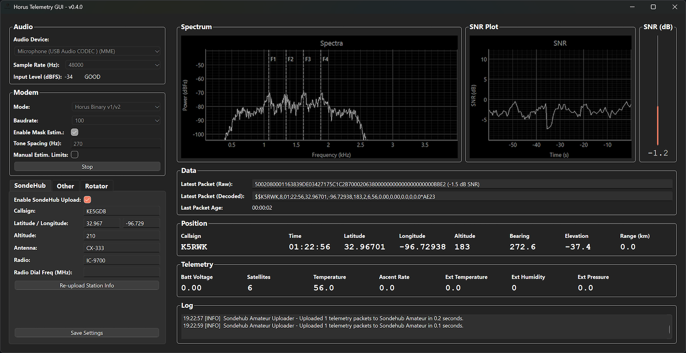

# Project Horus Telemetry Decoder

Telemetry demodulator for the following modems in use by Project Horus
* Horus Binary Modes (4FSK)
  * v1 - Legacy 22 byte mode, Golay(23,12) FEC
  * v2 - 16/32-byte modes, LDPC FEC (Under development)
* RTTY (7N1, 7N2 and 8N2, standard [UKHAS sentences](https://ukhas.org.uk/communication:protocol) with CRC16 only)

This project serves as a graphical front-end to [horusdemodlib](https://github.com/projecthorus/horusdemodlib) a Python/C library of telemetry demodulators based off the [codec2](https://github.com/drowe67/codec2) FSK modem. The core modem used in this library is very well tested, and performs in line with incoherent FSK demodulator theory. The RTTY decoder is approximately [2dB better](http://www.rowetel.com/?p=5906) than dl-fldigi, and the Horus Binary v1 modem approximately 7 dB better again. Once finished, the Horus Binary v2 modes should provide more flexibility over the v1 mode, and provide further performance improvements.

### Important Performance Notes
The FSK demodulator at the core of this application expects the transmitter to behave like a modem. That is, it should:
* Have a symbol rate which is close to the desired symbol rate (within +/- 1000 ppm).
* Maintain that symbol rate throughout a transmission (i.e. not drift in symbol rate across a transmission)
* Not have gaps between transmitted bytes.
* Not drift a lot in frequency during a transmission (a few Hz/sec is probably OK - this needs to be tested further)

All of the above are achievable from a small microcontroller such as an Arduino. The use of [interrupts](https://ukhas.org.uk/guides:interrupt_driven_rtty) (instead of sleep statements) to control symbol timing is recommended. Raspberry Pi UARTs (in particular the 'mini-UART') are known to have gaps between transmitter bytes, so be warned!

If you are having issues decoding telemetry from your payload, then carefully investigate the above points. If you are still having issues, then please contact me with a recording via the e-mail address below.

### Authors

Written by: 
* Python Library - Mark Jessop <vk5qi@rfhead.net>
* FSK Modem - [David Rowe](http://rowetel.com)
* FSK Modem Python Wrapper - [XSSFox](https://twitter.com/xssfox)
* LDPC Codes - [Bill Cowley](http://lowsnr.org/)



### Known Issues
* Occasional crash when processing is stopped just as a packet is being processed by horus_api.
* Queue events not processed on OSX when the application is running in the background.

### TODO LIST
* Important Things
  * Better build system via Travis (@xssfox)
* Extras
  * Waterfall Display  (? Need something GPU accelerated if possible...)
  * rotctld rotator control?

## Usage

### Binary Builds
Until we sort out automated release builds, some very early binary builds for Windows and OSX are available here: https://rfhead.net/horus/horusgui/

Please let me know if you have success using these! 

### Build HorusDemodLib

```console
$ git clone https://github.com/projecthorus/horusdemodlib.git
$ cd horusdemodlib && mkdir build && cd build
$ cmake ..
$ make
$ make install
```

### Grab this Repo
```console
$ git clone https://github.com/projecthorus/horus-gui.git
$ cd horus-gui
```

### (Optional) Create a Virtual Environment

Create a virtual environment and install dependencies.
```console
$ python3 -m venv venv
$ source venv/bin/activate
(venv) $ pip install pip -U       (Optional - this updates pip)
```

If not using a venv, you may need to replace `pip` with `pip3`, and `python` with `python3` below to ensure you are using Python3. Older linux distributions will likely have both Python 2.7 and Python 3 installed - this software only supports Python 3. On linux distros you may need to install `python3-venv`.

### Install Python Dependencies
```console
$ pip install -r requirements.txt
```

NOTE: Under linux based distros, you may also need to install `python3-distutils` and `python-setuptools`. If you get errors relating to pyaudio when trying to install into a venv, make sure that portaudio is installed (`libportaudio-dev` or `portaudio19-dev` under Linux distros, or `portaudio` under Macports), and then install pyaudio pointing to the portaudio lib by running:
```
(Linux) $ pip install --global-option='build_ext' --global-option='-I/usr/include' --global-option='-L/usr/lib' pyaudio
(OSX)   $ pip install --global-option='build_ext' --global-option='-I/opt/local/include' --global-option='-L/opt/local/lib' pyaudio
```
You should then be able to re-run the install requirements command above.

### Install Package

Install package in a editable state. This type of installation allows a
developer to make changes to the source code while retaining the installation
entry points so it can be used like a normal install.

```console
(venv) $ pip install -e .
```

### Run
```console
$ python -m horusgui.gui
```

Or run the helper startup script:
```console
$ python horus-gui.py
```

### Updating
As this repository is under regular development, you will likely need to update frequently. For those using the binary builds, this just means downloading a new file and running it. If you're running from source, this means updating both this repository, and horusdemodlib, on which it depends.

```console
$ cd ~/horusdemodlib
$ git pull
$ rm -rf build
$ cd horusdemodlib && mkdir build && cd build
$ cmake ..
$ make
$ make install

$ cd ~/horus-gui
# git pull
$ . venv/bin/activate  (if using a venv)
$ pip install horusdemodlib --upgrade
```

You should then be OK to run horusgui. Configuration settings will be reset when the version number of horus-gui is incremented, until I settle on on a configuration parameter set.
